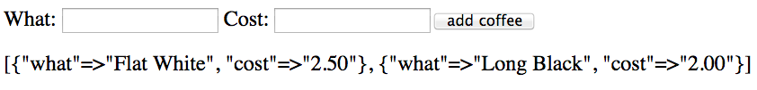
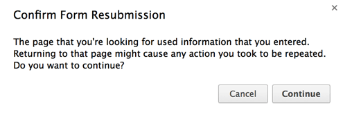
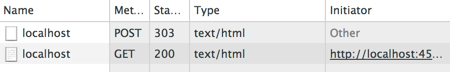

# Web基礎チュートリアル

*Created by Tim McEwan, [@tjmcewan](https://twitter.com/tjmcewan) / Translated by Daiki Kato, [@DAIKI__0381](https://twitter.com/DAIKI__0381)*

## 目標

情報がどのようにWebブラウザとやり取りされているか考えたことがありますか？このチュートリアルでは、HTTPについて調べることで、その仕組みを見ていきます。

今回は、[**Sinatra**](http://www.sinatrarb.com/)をツールとして使い、Webの基本的な原則をいくつか紹介します。Sinatraは、Rubyを使って最小限の労力でWebアプリを作成するための小さなフレームワークです。[Sinatraで作られたものはこちら](http://www.sinatrarb.com/wild.html)にリストアップされています。

SinatraはRailsとは異なります。どちらもWebアプリを書くのに役立つフレームワークですが、Sinatraには少ない機能と少ない魔法しかありません。

## はじめに

HTTPは、アプリ（Rails Girlsアプリなど）とブラウザの間で情報を送るために使用されます。
HTTPによる通信の基本は、リクエストとレスポンスがペアになっています。リクエストはブラウザからサーバー（あなたのアプリなど）に送られ、レスポンスはサーバーからあなたのブラウザに返され、ユーザーが閲覧することができます。

ブラウザでリクエストを送るには、URLを使用する必要があります。URLには、サーバーが正しいレスポンスを送れるように、どのような情報をリクエストしているのか、多くの情報が含まれています。

URLには、以下の内容が含まれます；

* 通信するプロトコル
* 必要な情報を持っているドメイン
* サーバー上のリソースへのパス
* オプションとして、リクエストに関する追加情報を含むパラメータが、キーと値のペアとして、URLの末尾にある場合があります。
* URLの先頭の//は、このリクエストがサーバーとの接続を希望していることを指しています。
* URLの末尾の？は、ファイルパスの終わりと、オプションのパラメーターの始まりを示しています。

URLは欲しいリソースを示しますが、そのリソースに対して実行する必要のあるアクションは、HTTP動詞を使って指定する必要があります。

HTTPの代表的な動詞は

* GET: 既存のリソースを取得する。
* POST: 新しいリソースを作成する。 (通常、新しいリソースを作成するために必要なデータが含まれます)
* PUT: 既存のリソースを更新する。
* DELETE: 既存のリソースを削除する。

Rails Girlsアプリで投稿やノートの表示、作成、編集、削除をできるようにしたとき、これらの動詞をすべて使ったことでしょう。

サーバーへのリクエストは、URLとHTTP動詞の両方を含める必要があります。

以下の演習では、どのようにブラウザがアプリと通信するのかを示すために、リソースフォルダ名とHTTP動詞の組み合わせを使った簡単なコーヒーリストアプリケーションを作成します。

あなたのアプリは、ブラウザ上でこのように表示されます：

## *0.* Sinatraをインストール - "Hello World"

まずはSinatraを起動させるところから始めましょう。

ターミナルで、gemをインストールします：

gem install sinatra
gem install sinatra-contrib


## *1.* "Hello World"
`app.rb`というファイルを作成し、以下をSublime Textに貼り付けます：


require "sinatra"
require "sinatra/reloader"

get "/" do
"Hello world!"
end


そして、ターミナルに戻って、このコードを実行します：

ruby app.rb


次のURLにアクセスして、現在のサイトを確認します： [http://localhost:4567](http://localhost:4567)

今ブラウザに表示されている情報は、GETリクエストに対するレスポンスです。

http://localhost:4567 にアクセスすると、SinatraサーバーにGETリクエストを送信することになります。

ブラウザに表示されるのは、Sinatraサーバーからのレスポンスです。

"/"と書いたところは、ルートURLを指定していますが、好きなパス名にすることができます。

同じファイルに、上のブロックと同じ構文を使用して、さらに訪問するページを作ってみてください。好きなだけページを追加して、好きなように表示させることができます。

e.g.

get "/page-name" do
 "This is text on the page"
 end


必要であれば、コマンドプロンプトで<kbd>Ctrl</kbd>+<kbd>C</kbd>を押してアプリを停止することができます。（Railsアプリの場合と同様です！）しかし、変更を確認するために停止したり開始したりする必要はありません。

もし行き詰まったら、`app.rb`が[このファイル](http://tjmcewan.github.io/coffeecalc/snippets/install_sinatra.rb.txt)のようになっていることを確認してください。

## *3.* HTML フォーム - パラメータを取得

アプリにコーヒーを掲載するには、どのコーヒーが欲しいのか、いくらなのかを送信するためのHTMLフォームが必要です。

これは、いくつかの情報を含むリクエストをSinatraサーバーに送信することを意味します。

サーバーに情報を送るには、フォームを使用します。

先程の`get "/"`を次のように置き換えてください：


get "/" do
"
<html>
<body>
<form action='/' method='get'>
What: <input name='what'>
Cost: <input name='cost'>
<button type='submit'>add coffee</button>
</form>
<!-- coffees go here -->
</body>
</html>
"
end



分かりやすくするために、このフォームでは同じURL（"/"）に情報を送信しています。

ブラウザを更新すると、先程作成したフォームが表示されるはずです。

では、フォームを送信したときに、ブラウザがサーバーに送信する内容を確認してみましょう。フォームにテキストを入力し、「add coffee」ボタンをクリックします。ターミナルに戻ってSinatraのログをチェックすると、次のようなものが表示されるはずです：


GET /?what=flat+white&cost=3.50 HTTP/1.1


**Coach:** パラメータ名がどこから来ているのか、クエスチョンマークは何をしているのかについて話しましょう。

なかなかうまくいかない場合は、[このファイル](http://tjmcewan.github.io/coffeecalc/snippets/html_form.rb.txt)のようなコードになるようにしてください。

## *4.* Webインスペクタ - リクエストヘッダー

ブラウザで、Webコンソールを開きます。（ほとんどのブラウザでは、ページ上で右クリックし、「検証」を選択することで開くことができます。）Chromeを使用している場合は、「ネットワーク」タブを探してください。

ブラウザを更新し、Webインスペクタで「localhost」の行をクリックし、「ヘッダー」タブで「ソースを表示」をクリックします。これと似たようなものが表示されるはずです：


GET / HTTP/1.1
Host: localhost:4567
Connection: keep-alive
Cache-Control: max-age=0
Accept: text/html,application/xhtml+xml,application/xml;q=0.9,image/webp,*/*;q=0.8
User-Agent: Mozilla/5.0 (Macintosh; Intel Mac OS X 10_9_1) AppleWebKit/537.36 (KHTML, like Gecko) Chrome/33.0.1750.70 Safari/537.36
Accept-Encoding: gzip,deflate,sdch
Accept-Language: en-US,en;q=0.8


**Coach:** HTTPヘッダーとは何か、その意味を説明しましょう。

注目すべきは1行目で、HTTP動詞と呼び出されたURLを示しています。

**Note:** もしSinatraがRubyの組み込みWebサーバである"WEBrickからのバックアップ"のログが表示されている場合、更新するたびに複数のGETリクエストが表示されるかもしれません。実際に発行されているのは1つのリクエストだけなので、他のリクエストは無視しても大丈夫です。

## *5.* グローバル変数

フォームからアプリにコーヒーの情報が送信されていますが、まだ何もしていません。コーヒーの情報がサーバーに送信されたら、それを保存する必要があります。

分かりやすくするために、コーヒーの詳細を変数に格納することにします。リクエスト間で利用できるように、[**グローバル変数**](http://en.wikipedia.org/wiki/Global_variable)を使用する必要があります。これは、Railsがモデル層を呼び出す処理を大幅に簡略化したものです。

これを `app.rb` のどこかに追加します（慣例では、一番上の `require` 行の下にあるはずです）：

$coffees = []


これにより、アプリの初回起動時に空の配列が作成されます。

**Hint:** このグローバル変数は、サーバーが再起動するたびに空の配列にリセットされるため、あまり長い間存在することはありません。今回はSinatraのreloaderを使っているので、`app.rb`ファイルを保存するたびにリセットされることになります。しかし、心配する必要はありません、今回の目的にはうまく合致しています。

## *6.* 情報の受信 - コーヒーの保存

ここで、リクエストを受け取ったときに、その情報を `$coffees` で定義した配列に格納する必要があります。フォームに必要事項を入力して送信ボタンをクリックすると、サーバーに送信される情報がURLの末尾の?の後に配置され、サーバーに送り返されることに注意してください。

SinatraはURLの末尾からその情報を取得し、`params`というハッシュとして利用できるようにします。例えば、以下のような感じです：


params = {coffee = 'flat white', value ='2'}


paramsハッシュからそれらを取り出し、`$coffees`に追加するコードを書く必要があります。

始める前に、まずフォーム内の `<!-- Coffees go here -->` を次のように置き換えます:


#{ $coffees.inspect }


これで、ブラウザのHTMLに`$coffees`が表示され、`$coffees`にコーヒーが追加されているかどうか（つまり、あなたのコードが機能しているかどうか）がわかるようになります。

**Hint:**
グローバル変数は配列なので、行き詰まった場合は、[Rubyの配列に関するドキュメント](http://www.ruby-doc.org/core-2.1.0/Array.html#method-i-3C-3C)を参照してください。

もし行き詰まったら、[ここをチェック](http://tjmcewan.github.io/coffeecalc/snippets/store_coffees.rb.txt)してください。

パラメータが正しく格納されていれば、ブラウザを更新して、毎回新しいハッシュが `$coffees` の配列に追加されることを確認できるはずです。

## *7.* 整える

`get`コードの中にある大きなHTMLの塊のせいで、このアプリが何をするのかがちょっとわかりにくくなっています。これを独自のメソッドに移しましょう。

HTMLフォームを`get`コードから切り取って、`template`というメソッドに貼り付けます（すべてのコードを同じファイルに保存してください）。こんな感じで：


def template
# put your HTML form string here
end


ここで、`get`コードのフォームを、次のように`template`というメソッドの単純な呼び出しに置き換えてください：


get "/" do
$coffees << params
template
end


これにより、フォームを再利用することが容易になります。

**Hint:** 何か問題が発生した場合は、 [ここをチェック](http://tjmcewan.github.io/coffeecalc/snippets/template_method.rb.txt)してください。

## *8.* GETを乗り越える

コーヒーの保存のところで見たように、ブラウザを更新すると、アプリは繰り返し`$coffees`に情報を追加します。これは、`get`コードがリクエストされるたびに、URLからパラメータを保存しているためです。

これは、`GET`リクエストはアプリに情報を追加するようなことをしてはいけないということを言及する良いポイントです。この例のようにうまくいくこともありますが、意図しない副作用が発生することがあります。この場合は `POST` リクエストを使用するのがよいでしょう。

`GET`リクエストはリソースの取得を求めるもので、`POST`リクエストはリソースの作成を求めるものであることを覚えておいてください。

では、この知識をもとに、フォームのメソッドを `POST` に変更してみましょう：

* フォームの中でメソッドを `get` としている箇所を探し、それを `post` に変更します。
* ブラウザをリフレッシュして、新しいコーヒーを投稿してください。

**Uh oh!** Sinatraのエラーページを見たことのない方は、Sinatraの素敵なエラーページへようこそ。一番下のメッセージにはこう書いてあるはずです：


Try this:
post '/' do
 "Hello World"
end


これは、リクエストされたルートが存在しないことを伝えています。HTTPエラー番号404としても知られているかもしれません： *page not found*と同じです。

## *9.* 投稿を追加

Sinatraに`post`コードを*追加*してみましょう（getは外さないでね！）：

* Sinatraの404ページから"Hello world"の`post`コードを取得し、`get`の後に配置します。(**Hint:** 上からコピーしないでください。このページはスマートクォートを使っているので、コードが壊れてしまいます)
* "Hello world"を`template`メソッドの呼び出しに置き換えます。 (**Hint:** `get`コードから`template`への呼び出しを削除しないでください)
* 次に、コーヒーのパラメータを保存する行を`get`コードから*移動*します。 (これは`template`への呼び出しの*上*にあることを確認してください)

いつものように、進捗状況を[こちら](http://tjmcewan.github.io/coffeecalc/snippets/get_vs_post.rb.txt)で確認することができます。

コーヒーを送信した後にページを更新すると、ページを読み込むためにフォームの再送信が必要であるというブラウザからの警告が表示されるはずです：

フォームを送信する際に、このような警告が表示されることがあります。この警告があることで、更新の結果について考えるようになり、同じコーヒーを不用意に何度も追加することを避けられるでしょう。

GETリクエストはリソースの取得を依頼するもので、POSTリクエストはリソースの作成を依頼するものであることを忘れないでください。GETリクエストでページを更新する場合、同じページを繰り返し表示するように要求しているだけなので、通常は問題ないでしょう。

しかし、POSTリクエストでページを更新した場合、POSTリクエストを再送することになり、更新するたびに新しいリソースを作成する可能性があります。そのため、ブラウザは更新を許可する前に警告を表示します。

## *10.* リダイレクトを追加

このフォームの再送信問題を回避するために、`POST`に対するレスポンスを受け取るとすぐに別のページを読み込むようにブラウザに指示することができます。 これは、"リダイレクト"として知られる特別なHTTPレスポンスを使用して行います。

`template`メソッドの呼び出しの代わりに、ブラウザを別の場所にリダイレクトすることができます。

Sinatraでは、このようになります：


redirect "/"


まずは試してみてから、[こちら](http://tjmcewan.github.io/coffeecalc/snippets/post_redirect.rb.txt)を確認してください。

これは、ブラウザが移動すべき場所を指定する `location` ヘッダを持つ特別なリダイレクトレスポンス (HTTP 303) を送り返すものです：


HTTP/1.1 303 See Other
<…>
Location: http://localhost:4567/


この動作を確認するには、ChromeのWebインスペクタ（ネットワークタブ）を見て、アプリにコーヒーを送ってみてください：

最初の行は、ブラウザが `POST` リクエストメソッドでフォームに送信していることを示しています。受け取ったレスポンスはHTTP 303で、`Location`ヘッダを含んでいます。そして、その場所（ルートURLである"/"）に対して `GET` リクエストを発行し、そこから得られたレスポンス（これがHTMLテンプレートです）をレンダリングしています。

これで、好きなだけ更新することができます。やっていることは `POST` ではなく `GET` を使ったリクエストです。ブラウザは、ページを表示するためにフォームを送信する必要はもうありません。

これでチュートリアルは終了です。あなたは素晴らしい仕事をしました！

遊んでくれてありがとうございました！

## 追加ガイド
続けてみたいという方は、ぜひお試しください：

* [rendering our coffee list in proper HTML](/sinatra-html)
**LUCY-TODO**
